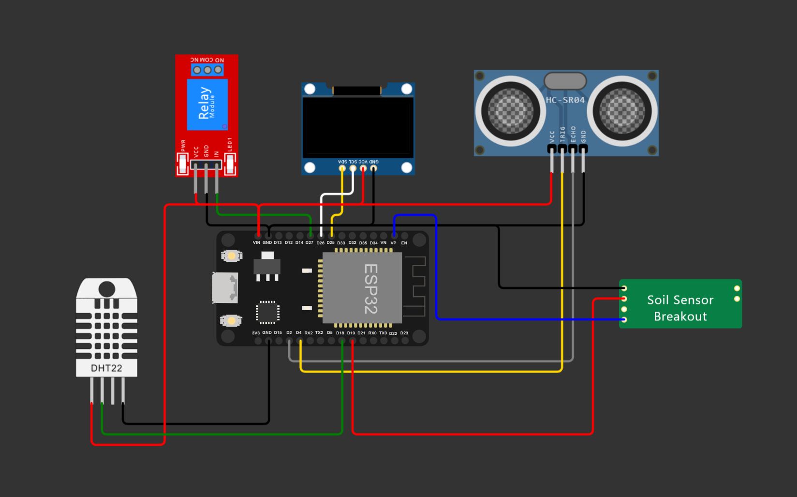

# Automatic Watering System - Phase 1

## Overview
The Automatic Watering System - Phase 1 is a project developed in C for the ESP32 microcontroller. This system is designed to automate the process of monitoring and maintaining soil moisture, temperature, and humidity levels, as well as controlling water levels and sending data to ThingSpeak. The project also includes unit testing using Catch2 to ensure code reliability.
Second phase will be installed in a greenhouse, some of the improvements will be, MTTQ protocol to use several esp32, OTA, and several more pumps and yl69's. 

A short movie is available for download if you would like to see it in action.
https://github.com/AlexGranberg/irrigation_system_ESP/blob/main/github_clip.mp4

## Future Developments (Phase 2)
The second phase of this project involves expanding its capabilities for use in a greenhouse. The planned improvements include:

- Implementation of MQTT protocol to enable communication between several ESP32 devices.
- Over-The-Air (OTA) updates for remote firmware upgrades and maintenance.
- Integration of multiple pumps and YL69 soil moisture sensors to support a larger and more complex irrigation system.
- Installation of servos to control windows that open and closes based on temperature data.

These enhancements will extend the system's functionality and scalability, making it suitable for more extensive agricultural applications.

## Hardware
This project requires the following hardware components:
- ESP32 microcontroller
- DHT22 sensor for temperature and humidity
- YL69 sensor for soil moisture
- Relay and water pump for irrigation control
- Ultrasonic sensor for reading water level
- SSD1306 OLED display for displaying sensor data and system status

Could not find the correct esp32 on wokwi so if you dont want to change the code the:
- Trigger from HC-sr04 should go to pin 0
- dht should go to pin 16
- yl69 VCC should go to pin 17 "Using a voltage (VCC) on the pin ensures that it doesn't read all the time, which can cause corrosion on the sensor"

KiCad schematics 
schematics_kicad.png

## Getting Started
To use this code and set up the Automatic Watering System, follow these steps:
1. Assemble the hardware components as per the provided schematics or documentation.
2. Set up the ESP32 development environment.
3. Ensure your Catch2 unit testing environment is set up (if required).
4. Configure WiFi credentials and ThingSpeak API key in the code.
5. Flash the code onto the ESP32 microcontroller.
6. Monitor the system through the OLED display and Thingspeak.

## Code Structure

The project's code is organized into the following source files and tasks:

- `main.c`: This file serves as the entry point for the project and orchestrates various tasks responsible for managing specific system components:

    - `yl69_task`: A FreeRTOS task dedicated to handling the YL69 soil moisture sensor and the pump.
    - `dht22_task`: Manages the DHT22 temperature and humidity sensor.
    - `ssd1306_task`: Controls the SSD1306 OLED display.
    - `ultrasonic_task`: Manages the ultrasonic sensor for water level measurement.

- `connect_wifi()`: This function initiates the WiFi connection for data transmission to ThingSpeak.

- `if (wifi_connect_status)`: A conditional statement that checks the success of the WiFi connection. If successful, it proceeds to create the `send_data_task` task for sending data to ThingSpeak.

- `dht.c`: Contains functions for interfacing with the DHT22 sensor to read temperature and humidity data.

- `yl69.c`: Manages the YL69 soil moisture sensor and provides functions for reading soil moisture levels.

- `ultrasonic.c`: Interacts with the ultrasonic sensor to make measurements.

- `connect_wifi.c`: Handles WiFi connectivity.

- `ssd1306.c`: Manages the OLED display to visualize soil moisture, temperature, humidity, water level, and WiFi status.

- `ssd1306_fonts.c`: Contains fonts, icons and gif data.

- `send_data_task.c`: Manage the connection to Thinkspeak and sends data.

Please refer to the individual source files for in-depth details on how each component of the system functions.

## Usage
1. Build the project by compiling the source files. Ensure that you have the ESP32 toolchain installed and configured.

2. Set your WiFi credentials and ThingSpeak API key in the appropriate sections of the code.

3. Upload the code to your ESP32.

4. Power on the system and monitor the OLED display to view real-time data and system status.

5. (Optional) Execute the unit tests using Catch2 to ensure the reliability of the code.

## Acknowledgments
This Automatic Watering System project is beeing developed by Alexander Granberg.

Feel free to modify and adapt this code for your own purposes or learn from it to create your own IoT-based projects.
Please be aware that when using some components like `dht.c` and `ssd1306.c` etc that include code from other sources, you should comply with the associated licensing terms provided in those files. Feel free to modify and adapt this code for your own purposes or learn from it to create your own IoT-based projects. Respect the licenses and rights of the original authors.

Enjoy automating your plant care with the Automatic Watering System - Phase 1!
